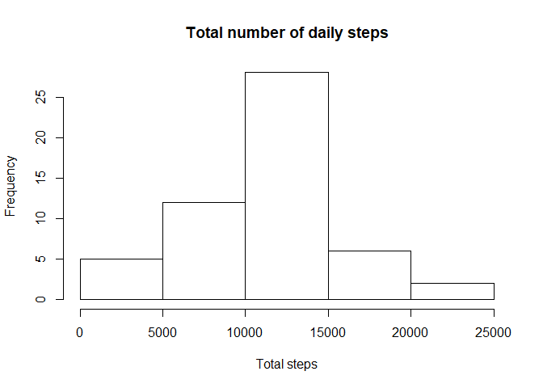
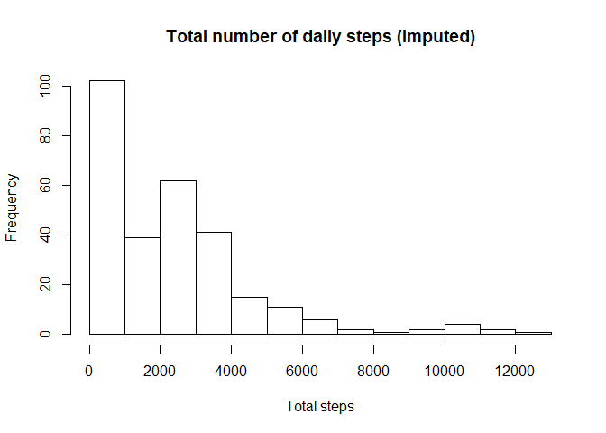

# Reproducible Research: Course Project 1
Steve Wenck  
June 27, 2017  

## Background

#### The original data for this assignment can be downloaded from the course web site:
- [Activity monitoring data](https://d396qusza40orc.cloudfront.net/repdata%2Fdata%2Factivity.zip) [52K]

#### See the README.md file in this repository for a description of the assignment.


## Loading and preprocessing the data

#### 1. Load the data (i.e. read.csv())

```r
## Set the working directory
setwd("~/R/Coursera/Data Science/Course 5/Assignment 1")

## Read the CSV file
activity <- read.csv("activity.csv")

## Describe the dataset
str(activity)
```

```
## 'data.frame':	17568 obs. of  3 variables:
##  $ steps   : int  NA NA NA NA NA NA NA NA NA NA ...
##  $ date    : Factor w/ 61 levels "2012-10-01","2012-10-02",..: 1 1 1 1 1 1 1 1 1 1 ...
##  $ interval: int  0 5 10 15 20 25 30 35 40 45 ...
```

#### 2. Process/transform the data into a format suitable for your analysis  

```r
## Convert date strings to date objects
activity$date <- as.Date(activity$date)

## Describe the dataset
str(activity)
```

```
## 'data.frame':	17568 obs. of  3 variables:
##  $ steps   : int  NA NA NA NA NA NA NA NA NA NA ...
##  $ date    : Date, format: "2012-10-01" "2012-10-01" ...
##  $ interval: int  0 5 10 15 20 25 30 35 40 45 ...
```


## What is the mean total number of steps taken per day?

To determine the mean total number of steps taken per day, first the mean
number of steps per day has to be calculated. Then the results can be plotted.

#### 1. Calculate the total number of steps taken per day

```r
## Aggregate steps for each date in dataframe
StepsPerDay <- aggregate(steps~date,activity,sum)
```

#### 2. Make a histogram of the total number of steps taken each day

```r
## Histogram of the total number of steps taken each day
hist(StepsPerDay$steps,xlab="Total steps",main="Total number of daily steps")
```

<!-- -->

#### 3. Calculate and report the mean and median total number of steps taken per day

```r
## Calculate and report the mean and median total number of steps taken per day
StepsPerDayMean <- mean(StepsPerDay$steps, na.rm=TRUE)
StepsPerDayMedian <- median(StepsPerDay$steps, na.rm=TRUE)
```
The **mean** number of steps taken per day is 1.0766189\times 10^{4}.  
The **median** number of steps taken per day is 10765.


## What is the average daily activity pattern?

To determine the average daily activity pattern, first the mean number of steps
per interval has to be calculated. Then the results can be plotted.

#### 1. Make a time series plot (i.e. type = "l") of the 5-minute interval (x-axis) and the average number of steps taken, averaged across all days (y-axis)

```r
## Aggregate steps per interval and calculate the mean for each interval
StepsPerInterval <- aggregate(steps~interval,activity,mean)

## Rename column on average steps per interval dataset for merging
names(StepsPerInterval)[names(StepsPerInterval) == 'steps'] <- 'AverageSteps'

## Time series plot of 5-minute interval and average steps taken
plot(StepsPerInterval,type="l",xlab="Interval [5-min increments]",ylab="Average number of steps",main="Average number of steps per interval")
```

<!-- -->

#### 2. Which 5-minute interval, on average across all the days in the dataset, contains the maximum number of steps?

```r
## Determine and report 5-minute interval containing max number of steps
MaxSteps <- StepsPerInterval$interval[which.max(StepsPerInterval$AverageSteps)]
```
The five-minute interval containing the maximum number of step is 835.  


## Imputing missing values

Note that there are a number of days/intervals where there are missing values
(coded as **NA**). The presence of missing days may introduce bias into some
calculations or summaries of the data.

#### 1. Calculate and report the total number of missing values in the dataset (i.e. the total number of rows with **NA**s)

```r
## Calculate and report total number of missing values in the dataset
MissVals <- sum(is.na(activity))
```
The total number of missing values in the dataset is 2304.  

#### 2. Devise a strategy for filling in all of the missing values in the dataset.

The strategy is not sophisticated. I used the mean number of steps for each
5-minute interval as the data to fill in for missing values. The mean number
of steps for each 5-minute interval has already been calculated above in the
"average daily activity pattern section."


```r
## Merge Activity and Average Steps Per Interval datasets for imputation
ImputedActivity = merge(activity, StepsPerInterval, by="interval")
```

#### 3. Create a new dataset that is equal to the original dataset but with the missing data filled in.

```r
## Impute missing steps in Activity with average steps per interval
ImputedActivity$steps[is.na(ImputedActivity$steps)] = ImputedActivity$AverageSteps[is.na(ImputedActivity$steps)]
```

#### 4. Make a histogram of the total number of steps taken each day

Again, the total number of steps taken each day (imputed) needs to be
calculated before it can be plotted.


```r
## Aggregate steps per interval and calculate the mean for each interval on imputed data
AggregatedImputedActivity <- aggregate(steps~interval,ImputedActivity,sum)

## Histogram of the total number of steps taken each day (with imputed data)
hist(AggregatedImputedActivity$steps,xlab="Total steps",main="Total number of daily steps (Imputed)")
```

<!-- -->

#### 5. Calculate and report the **mean** and **median** total number of steps taken per day.

```r
## Calculate and report the mean and median total number of steps taken per day (with imputed data)
ImputedStepsPerDayMean <- mean(AggregatedImputedActivity$steps, na.rm=TRUE)
ImputedStepsPerDayMedian <- median(AggregatedImputedActivity$steps, na.rm=TRUE)
```
The **mean** number of steps taken per day (imputed) is 2280.3385744.  
The **median** number of steps taken per day (imputed) is 2080.9056604.

#### 6. Do these values differ from the estimates from the first part of the assignment?

```r
## Calculate difference between unimputed and imputed mean/median number of steps per day
DiffMean <- ImputedStepsPerDayMean - StepsPerDayMean
DiffMedian <- ImputedStepsPerDayMedian - StepsPerDayMedian
```

Filling in missing data with any non-missing data will have an effect on the
estimates, regardless of the data used to fill in the missingness.

#### 7. What is the impact of imputing missing data on the estimates of the total daily number of steps?

In this case the **mean** number of daily steps changed by -8485.8501048 steps,
while the **median** number of daily steps changed by -8684.0943396 steps.

## Are there differences in activity patterns between weekdays and weekends?

For this part the **weekdays()** function was used. I used the dataset
with the filled-in (imputed) missing values for this part.

#### 1. Create a new factor variable in the dataset with two levels - "weekday" and "weekend" indicating whether a given date is a weekday or weekend day.

```r
## Create function to classify the type of day  as a factor
DayCategory <- function(date) {
    if (weekdays(date) %in% c("Saturday", "Sunday")) {
        "weekend"
    } else {
        "weekday"
    }
}

## Apply DayCategory function to the date field in the ImputedActivity dataset
ImputedActivity$DayCat <- as.factor(sapply(ImputedActivity$date, DayCategory))

##Describe dataset
str(ImputedActivity)
```

```
## 'data.frame':	17568 obs. of  5 variables:
##  $ interval    : int  0 0 0 0 0 0 0 0 0 0 ...
##  $ steps       : num  1.72 0 0 0 0 ...
##  $ date        : Date, format: "2012-10-01" "2012-11-23" ...
##  $ AverageSteps: num  1.72 1.72 1.72 1.72 1.72 ...
##  $ DayCat      : Factor w/ 2 levels "weekday","weekend": 1 1 2 1 2 1 2 1 1 2 ...
```

#### 2. Make a panel plot containing a time series plot (i.e. **type = "l"**) of the 5-minute interval (x-axis) and the average number of steps taken, averaged across all weekday days or weekend days (y-axis).

I used the lattice package to replicate example time series panel plot in the
assignment materials. To determine the average daily activity pattern on the
imputed data, first the mean number of steps per interval has to be calculated.
Then the results can be plotted.


```r
## Load the plyr package
library(plyr)

## Summarize data by interval and type of day
ImputedStepsPerIntervalDayCat <- ddply(ImputedActivity,.(interval,DayCat),summarize,AverageSteps=mean(steps))

## Load the lattice package
library(lattice)

## Time series plot of 5-minute interval and average steps taken (Imputed) by type of day
xyplot(AverageSteps~interval|DayCat,data=ImputedStepsPerIntervalDayCat,type="l",layout = c(1,2),
       main="Average steps (imputed) per interval and type of day",
       ylab="Average number of steps",xlab="Interval [5-min increments]")
```

<!-- -->
